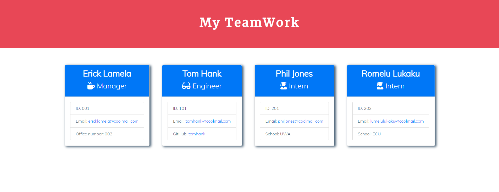

<h1 align="center"> Object-Oriented Programming: 
<br>Team Profile Generator 👋</h1>
<p align="center">
  <a href="#">
  
  <a href="#">
  
  <a href="#">
  
  
  <a href="#">
  
  <a href="#">
  
  <a href="#">
  <br>
  <a href="https://www.buymeacoffee.com/adampham123">
  
  <a href="#">
  
  <a href="#">
  
  <a href="https://github.com/ThiHoangPham/team-profile-generator-adam-homework10/blob/main/LICENSE">
  
  </a>
  <a href="#">
  
  <a href="#">
  
  </a>
  <a href="#">
  
  </a>
  <a href="#">
  
  </a>
  <a href="https://twitter.com/AdamThaiHoang1">
  
  </a>
</p>
<hr>

## Description:
Object-Oriented Programming : Build a Node.js command-line application that takes in information about employees on a software engineering team, then generates an HTML webpage that displays summaries for each person.

## User Story:
```
AS A manager
I WANT to generate a webpage that displays my team's basic info
SO THAT I have quick access to their emails and GitHub profiles
```
## Acceptance Criteria
```
GIVEN a command-line application that accepts user input
WHEN I am prompted for my team members and their information
THEN an HTML file is generated that displays a nicely formatted team roster based on user input
WHEN I click on an email address in the HTML
THEN my default email program opens and populates the TO field of the email with the address
WHEN I click on the GitHub username
THEN that GitHub profile opens in a new tab
WHEN I start the application
THEN I am prompted to enter the team manager’s name, employee ID, email address, and office number
WHEN I enter the team manager’s name, employee ID, email address, and office number
THEN I am presented with a menu with the option to add an engineer or an intern or to finish building my team
WHEN I select the engineer option
THEN I am prompted to enter the engineer’s name, ID, email, and GitHub username, and I am taken back to the menu
WHEN I select the intern option
THEN I am prompted to enter the intern’s name, ID, email, and school, and I am taken back to the menu
WHEN I decide to finish building my team
THEN I exit the application, and the HTML is generated
```
## Table of Contents:
- [Description](#description)
- [User Story](#user-story)
- [Acceptance Criteria](#acceptance-criteria)
- [Walkthrough Video](#walkthrough-video)
- [Installation](#installation)
- [Test Instructions](#test-instructions)
- [Contributor](#contributor)
- [Contribution](#contribution)
- [Contact Information](#contact-information)
- [Live Result Page](#live-result-page)

## Walkthrough Video: 
<a href="https://watch.screencastify.com/v/g5VTC1011imFkKS0vZSX">
  
  </a>

## Installation:
`npm install`

## Test Instructions:
`npm run test`, `node app.js`

## Contributor:
<a href="https://github.com/ThiHoangPham">
  
  </a>

## Contribution:
Please email to me if you have any contribution, I am more than happy with that. Thank you!

## Contact Information:

Github: [Thai Hoang(Adam), Pham](https://github.com/ThiHoangPham)

Email: thaihoangpham2008@gmail.com

## Live Result Page: [Click Here!](https://thihoangpham.github.io/team-profile-generator-adam-homework10/exampleTeam.html)

<p align ="right"><a href="#">↥ back to top</a></p>

- - -

© 2021 Thai Hoang(Adam), Pham: Team Profile Generator